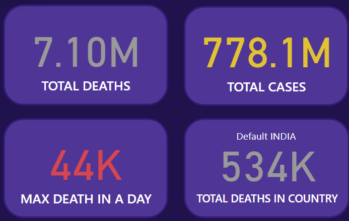
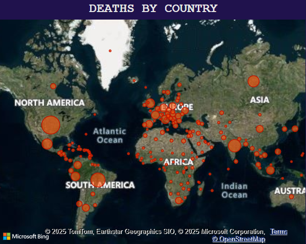
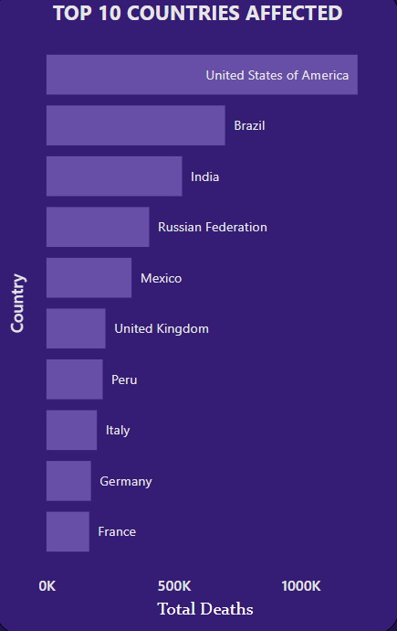
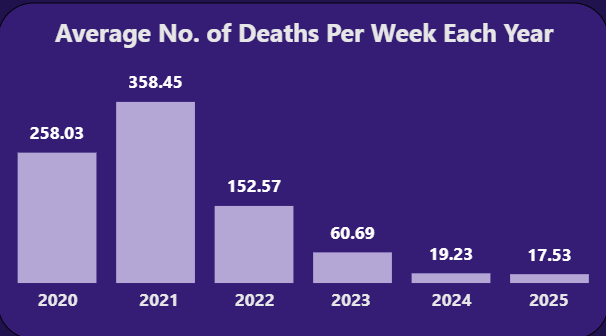
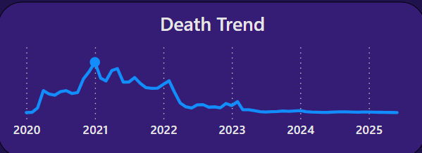
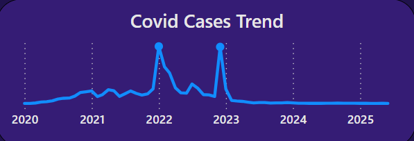

# 🌐 COVID 19 - Pandemic Trends Power BI Dashboard

This project presents an interactive Power BI dashboard designed to provide a comprehensive analysis of global COVID-19 trends and impacts. The dashboard incorporates key performance indicators (KPIs), geospatial maps, time-series visualizations, and filter-based interactivity to present the progression and severity of the pandemic in an accessible and meaningful way.

The dataset for this project was sourced from **Kaggle**, and the entire dashboard — including the visual design, data modeling, and analytical logic — was developed independently by me, with occasional use of AI tools for efficiency and inspiration.

> 📥 **Download the COVID-19 Power BI Dashboard**  
> [🔗 COVID19_Dashboard.pbix](COVID-19.pbix)

## 🎯 Project Objectives

- **Highlight Key Global COVID-19 Metrics**  
  Present KPIs like Total Cases, Total Deaths, Peak Daily Deaths, and Country-Specific Metrics.

- **Geographical Mapping of Impact**  
  Use interactive maps to visualize country-wise death counts.

- **Time-Series Analysis**  
  Uncover patterns in cases and deaths over time.

- **Top Countries Analysis**  
  Showcase the countries most affected by COVID-19 using ranked charts.

- **User-Driven Interaction**  
  Enable page-level filters for customizable, region-specific insights.

---

## 📄 Dataset Source

The dataset was sourced from Kaggle, containing daily records of COVID-19 cases and deaths by country. It includes cumulative counts, making it ideal for time-series and cross-country analysis.

---

## ✨ Power BI Skills Utilized

- **🔍 Exploratory Data Analysis (EDA)** – Identified trends and structured insights
- **📊 Data Visualization** – Created charts, KPIs, slicers, and maps
- **⚙️ Power Query** – Performed data cleaning and transformation
- **📐 Power Pivot** – Managed relationships and data model
- **📈 DAX** – Developed calculated metrics like average deaths, total cases, and trend lines

---

## 💡 Key Performance Indicators (KPIs)

| KPI                              | Description                                  | Value       |
|----------------------------------|----------------------------------------------|-------------|
| **Total Deaths (Global)**        | Cumulative global deaths                     | ~7 Million  |
| **Total Cases (Global)**         | Cumulative global cases                      | ~700 Million |
| **Max Deaths in a Single Day**   | Highest recorded deaths in one day globally  | ~44,000     |
| **India Deaths (Default Country)** | Total deaths in India (can be filtered)      | ~534,000    |

---

## 🌍 Geographic Visuals

### 🗺️ World Map – COVID-19 Deaths by Country
- Bubble size indicates death count magnitude.
- Interactive map offers a global view of the pandemic’s impact.

---

## 📊 Country-Level Breakdown

### Top 10 Countries by Death Count
- A horizontal bar chart shows the most affected countries.
- The **USA** leads with the highest reported deaths.

---

## 📆 Time-Series & Trend Analysis

### Weekly Average Deaths by Year
- A column chart showing average weekly deaths.
- **2021** recorded the highest peak in deaths.

### Year-Month Line Trends
- **Total Deaths Trend:** Peaks in **Jan 2021**.

- **Total Cases Trend:** Highest spikes in **Jan 2022** and **Dec 2022**.

---

## 🎨 Dashboard Design & Usability

- **Consistent color schemes and layout**
- **Page-level filters** on the top right for easy interactivity
- Clean visuals and easy navigation structure

---

## ⚙️ Filter Panel

The interactive filter panel includes:

- **Country Selector** – Focus on specific regions
- **Date Range Filter** – Drill down into time periods
- **Clear All Filters** 

This enhances the dashboard's flexibility and exploration capabilities.

---

## ✍️ Conclusion

This COVID-19 Power BI dashboard project helped me:

- Apply real-world data storytelling techniques  
- Practice DAX and Power Query transformations  
- Build a well-structured, interactive, and insightful dashboard  

By visualizing key global metrics and time-based trends, this dashboard allows for a deeper understanding of the pandemic’s severity across time and regions.

This project demonstrates how Power BI can be used to create powerful and meaningful narratives through data. I look forward to applying these skills to more real-world datasets in the future!

---
